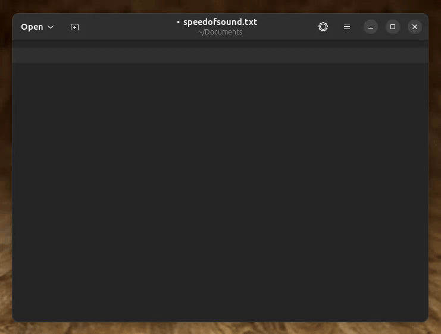

  

# Speed of Sound

Speed of Sound enables voice typing on the Linux desktop, allowing you to type at over 100 words per minute—more than double the average typing speed with a keyboard—and reducing the risk of repetitive strain injury (RSI).

Here's the app in action, typing into Text Editor:

  

## Features

- 🏠 **Local and Cloud Options** - Works with local speech recognition models (like Faster Whisper) as well as cloud providers (OpenAI)
- 🖥️ **Cross-Platform Compatibility** - Supports both X11 and Wayland with pluggable typing backends (AT-SPI, `xdotool`, `ydotool`)
- 🔌 **GNOME Shell Extension** - Provides a status indicator and system-wide keyboard shortcut
- 🎨 **Modern UI** - Built with the GNOME Adwaita design system, compatible with any desktop environment
- 🎮 **Accessibility** - Joystick/gamepad control support

## Installation

### Step 1: Download the app

> 🔜 **Flatpak and Snap support:** Support for both is well underway. If you are familiar with either, please review and provide feedback on the current setup. The plan is to submit the app to Flathub and Snapcraft soon™.

Meanwhile, read [`docs/install.md`](docs/install.md) for installation instructions.

### Step 2: Set up how to trigger the app

Speed of Sound runs in the background waiting to be triggered when you want to start voice typing. You can set up a keyboard shortcut and/or a joystick as triggers.

Read [`docs/trigger.md`](docs/trigger.md) for instructions.

### Step 3: Configure virtual keyboard permissions

Speed of Sound emulates a keyboard to type into any desktop application. Depending on your system, you may need to set up additional user permissions.

Read [`docs/input.md`](docs/input.md) for details.

### (Optional) Step 4: Install the GNOME Shell Extension

Speed of Sound includes an optional GNOME Shell extension that adds a status indicator to the top bar. This extension is not required to use Speed of Sound but provides useful features like a system-wide keyboard shortcut and desktop notifications.

Read [`extension/README.md`](extension/README.md) for installation instructions.

### (Optional) Step 5: Configure the app

Speed of Sound uses a `config.toml` file for all settings. When you first launch the application, it will automatically create a default configuration that uses a local Faster Whisper model for speech recognition. It will also automatically download the right model files for local usage.

Besides Faster Whisper, Speed of Sound supports other providers including OpenAI GPT-4o. 

Read [`docs/config.md`](docs/config.md) for additional configuration options.

## Usage Instructions

Once you have completed the installation steps above, using Speed of Sound works as follows:
1. Open any application on your desktop, for example, the text editor.
1. Trigger Speed of Sound using the keyboard shortcut (default is `Super+Z`) or joystick.
1. The main window of the application will open and start listening automatically.
1. Trigger the application again to stop listening and start transcribing.
1. Once the transcription is ready, the main window will hide itself, and Speed of Sound will type the resulting text directly into the application you were using (the text editor in this example).

Rinse and repeat.

You can cancel typing by pressing **Escape** when the app is listening. Also, note that listening will automatically stop after 60 seconds (this is configurable).

## ⚠️ Privacy Considerations

By default, Speed of Sound is preconfigured to work fully offline using Faster Whisper without requiring an internet connection. When operating this way, no data leaves your computer—everything runs locally on your device. We don't collect metrics, analytics, or any sort of telemetry. And you don't need to take our word for it—the code is open source.

However, if your machine lacks the processing power to run a speech recognition model locally or you need higher-quality transcriptions from larger cloud-based models, cloud providers are also supported. The choice of which model to use is entirely yours. Keep in mind that while cloud providers are convenient to set up and typically inexpensive, your audio data is shared with third parties, so you should review their terms of service and privacy policies.

> ℹ️ **Tip:** One common pattern is maintaining separate configuration files for different use cases. For example, you could have a `config-local.toml` for sensitive work where no data should leave your computer, and a `config-cloud.toml` for less sensitive situations like typing into public websites or generating public content. Before starting the app, you would `cp` the right one under `~/.config/io.speedofsound.App/config.toml`.

## Troubleshooting

You can test your audio and transcription settings from the terminal using the included `launch.py` utility.

Read [`docs/troubleshooting.md`](docs/troubleshooting.md) for instructions.

### Reporting Issues

If you encounter any bugs, have feature requests, or need help with Speed of Sound, please open an issue on this repository:

**[Report an Issue](https://github.com/zugaldia/speedofsound/issues)**

When reporting issues, please include:
- Your operating system and version
- The model and configuration you're using
- Steps to reproduce the issue
- Any relevant error messages or logs
