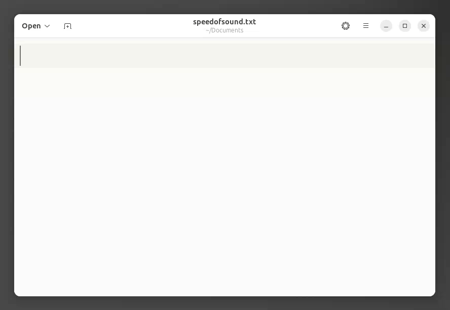

  

# Speed of Sound

Voice typing for the Linux desktop: press a key to start, speak, press again to insert:

  

## Features

- Offline, on-device transcription using Whisper. No data leaves your machine.
- Types the result directly into any focused application using Portals for wide desktop support (X11, Wayland).
- [Multi-language support](https://github.com/openai/whisper#available-models-and-languages) with switchable primary and secondary languages on the fly.
- Works out of the box with the built-in Whisper Tiny model. Download additional models from within the app to improve accuracy.
- *Optional* text polishing with LLMs (Anthropic, Google, OpenAI), with support for a custom context and vocabulary.
- Supports self-hosted services like vLLM, Ollama, and llama.cpp (cloud services supported but not required).

## Getting Started

For installation and usage information, see [speedofsound.io](https://speedofsound.io).

## Contributing

To build the project from source and learn how to contribute, see [CONTRIBUTING.md](CONTRIBUTING.md).

## Built with

Speed of Sound stands on the shoulders of these excellent open source projects:

- [Java-GI](https://github.com/jwharm/java-gi) — GTK/GNOME bindings for Java, enabling access to native libraries
  (including LibAdwaita and GStreamer) via the modern Panama framework.
- [Sherpa ONNX](https://github.com/k2-fsa/sherpa-onnx) — On-device ASR (and more) using the performant ONNX Runtime,
  including pre-built models for Whisper and many other popular models.
- [Whisper](https://github.com/openai/whisper) — OpenAI's open-source speech recognition model.
  Its release transformed the on-device ASR landscape.

Additionally, Speed of Sound uses [Stargate](https://github.com/zugaldia/stargate), a companion project by the same
author that provides JVM applications with high-level access to [XDG Desktop Portals](https://flatpak.github.io/xdg-desktop-portal/docs/index.html)
on Linux. Stargate, in turn, depends on the fantastic [dbus-java](https://github.com/hypfvieh/dbus-java) project.

## Support and Contributions

If you run into any issues, have questions, or need troubleshooting help, please open a ticket on the
[GitHub issues page](https://github.com/zugaldia/speedofsound/issues). Pull requests are also welcome.

When reporting an issue, please include the debug information from the About dialog's Troubleshooting
section, it helps identify your runtime environment and system configuration.

There are several ideas already tracked as tickets to improve the project. Everything planned on the
roadmap has a corresponding issue. If you'd like to contribute, please use those tickets to guide your
work. You can also use GitHub emoji reactions on issues to vote for the ones that matter most to you,
which helps with prioritization.
