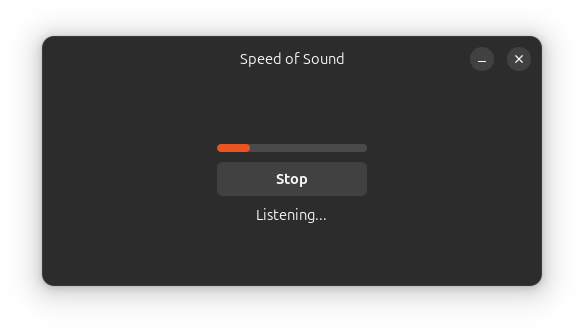

# Speed of Sound

Speed of Sound (SOS) provides voice typing for any Linux desktop application, powered by state-of-the-art speech recognition models, both local and cloud-based.
<div align="center">
  
</div>

## Features

- 🏠 **Local and Cloud Support** - Works with local models (Whisper, NVIDIA Riva) and cloud providers (ElevenLabs, Google Gemini, NVIDIA NIM, OpenAI)
- 🖥️ **Cross-Platform Compatibility** - Supports both X11 and Wayland with pluggable backends (AT-SPI, `xdotool`, `ydotool`)
- 🔌 **GNOME Shell Extension** - System-wide keyboard shortcuts and desktop notifications
- 🎨 **Modern UI** - Built with GNOME Adwaita design system, compatible with any desktop environment
- 🎮 **Accessibility** - Joystick/gamepad control support

## Launch the App

Clone the repository, install dependencies, and launch the application:

```bash
# Install system dependencies
sudo apt install libgirepository-2.0-dev

# Clone and set up the project
git clone git@github.com:zugaldia/speedofsound.git
cd speedofsound
python3 -m venv venv
source venv/bin/activate
pip3 install -r requirements.txt

# Launch the application
python3 launch.py
```

## GNOME Shell Extension

Speed of Sound includes an optional GNOME Shell extension for enhanced functionality. The extension provides:

- Status indicator in the top bar
- System-wide keyboard shortcut
- Desktop notifications

**Installation**: [Follow the extension setup instructions](./extension/README.md) 

## Activation

Choose how to activate voice input:

1. **GNOME Shell Extension** (Recommended) - Use `Super+Z` to start/stop voice typing from any application
2. **Custom Keyboard Shortcut** - Set up a global shortcut without the extension
3. **Joystick/Gamepad** - Use a connected controller for activation

For manual shortcuts and joystick setup, see the [trigger configuration guide](docs/trigger.md).

## Configuration

Speed of Sound uses a `config.toml` file for all settings. Start by copying the example configuration:

```bash
cp config.example.toml config.toml
```

The default configuration uses a local Whisper server for privacy-focused speech recognition. For additional providers and configuration options, see the [configuration documentation](docs/config.md).

## Reporting Issues

If you encounter any bugs, have feature requests, or need help with Speed of Sound, please open an issue on this repository:

**[Report an Issue](https://github.com/zugaldia/speedofsound/issues)**

When reporting issues, please include:
- Your operating system and version
- The model and configuration you're using
- Steps to reproduce the issue
- Any relevant error messages or logs
