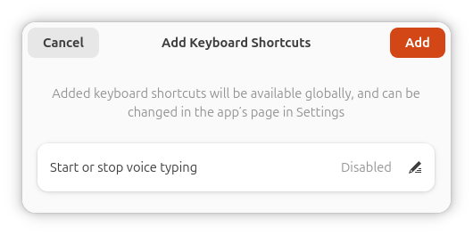
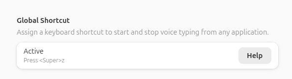

# Set Up a Keyboard Shortcut

By default, `Super+Z` starts and stops listening, but only when the Speed of Sound window is open and focused.
For a better experience, we recommend setting up a global shortcut in Preferences. 
This lets you keep the window minimized or hidden and trigger Speed of Sound from anywhere, typing directly into any app.

## Option 1: Automatic Setup

This is the easiest way to set up a global shortcut. It uses a mechanism called the Global Shortcuts Portal,
which is supported across desktop environments like GNOME and KDE, on both X11 and Wayland.

1. Open **Preferences** in Speed of Sound and click the **Set Up** button under **Global Shortcut**.
   If the button is not available, your desktop environment does not support the Global Shortcuts Portal.
   Proceed to Option 2 instead.

2. A system dialog will appear prompting you to assign a keyboard shortcut.
   By default, Speed of Sound suggests `Super+Z`, but you can enter any key combination(s) you prefer.



3. *(If prompted)* An additional dialog may ask you to allow the application to inhibit
   shortcuts. This means Speed of Sound will be able to capture your chosen key combination system-wide
   while listening. Click **Allow** to proceed.

4. Click **Add** in the system dialog to confirm your shortcut.



Once set up, the Preferences page will update to show the shortcut(s) you selected. That's it.
You can now trigger Speed of Sound from anywhere.

## Option 2: Use Your Desktop Environment Settings

In this step, you will manually assign a global keyboard shortcut using your desktop environment settings.
The exact steps vary by desktop environment and distribution. On GNOME, for example:

1. Open **Settings** and navigate to **Keyboard**.
2. Click **View and Customize Shortcuts**.
3. Scroll to the bottom and select **Custom Shortcuts**.
4. Click the **+** button to add a new shortcut and fill in the fields:
    - **Name:** anything you like, e.g. `Speed of Sound`
    - **Command:** the full path to the trigger script, e.g. `/home/your-username/speedofsound/trigger.sh`
    - **Shortcut:** press your desired key combination, e.g. `Super+Z`
5. Click **Add** to save.

You can add multiple shortcuts targeting the same trigger script if you wish to.

## Option 3: Advanced

Options 1 and 2 are the recommended ways to set up a trigger. However, if neither option works for your setup,
or if you need more control over when and how dictation is triggered, you can call the application directly via D-Bus.

This is exactly what the `trigger.sh` script in Option 2 does under the hood.
You can use this information to build any custom script, desktop environment integration, or automation workflow:

- **Bus:** Session bus
- **Destination:** `io.speedofsound.SpeedOfSound`
- **Object path:** `/io/speedofsound/SpeedOfSound`
- **Method:** `org.gtk.Actions.Activate`
- **Action name:** `trigger`

Using `gdbus`, the call looks like this:

```bash
gdbus call \
   --session \
   --dest io.speedofsound.SpeedOfSound \
   --object-path /io/speedofsound/SpeedOfSound \
   --method org.gtk.Actions.Activate "trigger" [] {}
```

If you installed Speed of Sound as a Flatpak or a Snap, D-Bus activation will automatically launch the application
when this call is made (we set `DBusActivatable=true` in the `.desktop` file). For other installation methods,
the application must already be running for this call to succeed.
