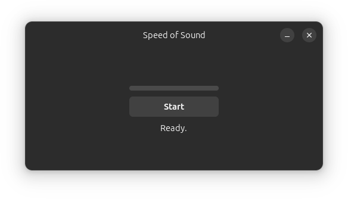
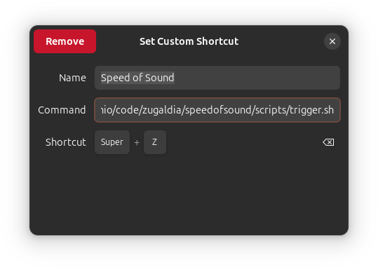

# Trigger Methods

Speed of Sound (SOS) provides three different methods to activate voice input, each designed for different use cases and accessibility needs. Once activated, the application will capture your voice, transcribe it using your configured AI model, and minimize itself to type the result into the currently active window.

## Main Screen Button

This is the most straightforward method to use SOS and is ideal for initial testing and getting familiar with the application. However, the keyboard and joystick methods explained below are preferable for daily usage due to their convenience.



To use the main screen button:

1. Click on the SOS application icon to bring it to the front
2. Tap the **Start** button to begin recording your voice
3. Speak your message
4. Tap the **Stop** button to finalize the recording and kick off transcription

The application will then process your speech and automatically type the transcribed text into the previously active window.

## Keyboard Shortcut

Setting up a keyboard shortcut allows you to activate SOS from anywhere without having to switch to the application window first. This method is ideal for daily usage and provides quick access to voice input.

To set up a keyboard shortcut using GNOME system settings:

1. Open **Settings** from the applications menu
2. Navigate to **Keyboard**
3. In the **Keyboard Shortcuts** section, click **View and Customize Shortcuts**
4. Scroll down to **Custom Shortcuts** and click the **+** (plus) button to create a new shortcut
5. Configure the new shortcut:
   - **Name**: Enter a descriptive name (e.g., "Speed of Sound" for easy identification)
   - **Command**: Enter the full path to the provided trigger script: `/path/to/scripts/trigger.sh`
   - **Shortcut**: Press your desired key combination (e.g., **Super+Z**)



Once configured, you can activate voice input from any application by pressing your chosen keyboard shortcut.

Make sure the trigger script is executable by running:

```bash
chmod +x /path/to/scripts/trigger.sh
```

## Joystick/Gamepad

Joystick/gamepad control provides enhanced accessibility and allows for activation without reaching for the keyboard. This method is particularly useful for users who prefer physical button controls or need a simple mechanism that requires fewer key presses.

**Basic Usage:**
- Press the **B button** to activate voice input and begin recording
- Press the **B button** again to stop recording and queue the transcription
- The application will automatically minimize itself to type the text into the active window

**Language Switching:**
The joystick also allows you to switch between languages on the fly:
- **Left button**: Switch to English (default)
- **Right button**: Switch to Spanish (default)

**Configuration:**
If multiple joysticks are connected to your system, you can specify which joystick to use by configuring the joystick ID parameter in the `config.toml` file. The language assignments for the left and right buttons are also configurable through the configuration file. For more details on these configuration options, see [docs/config.md](config.md).
